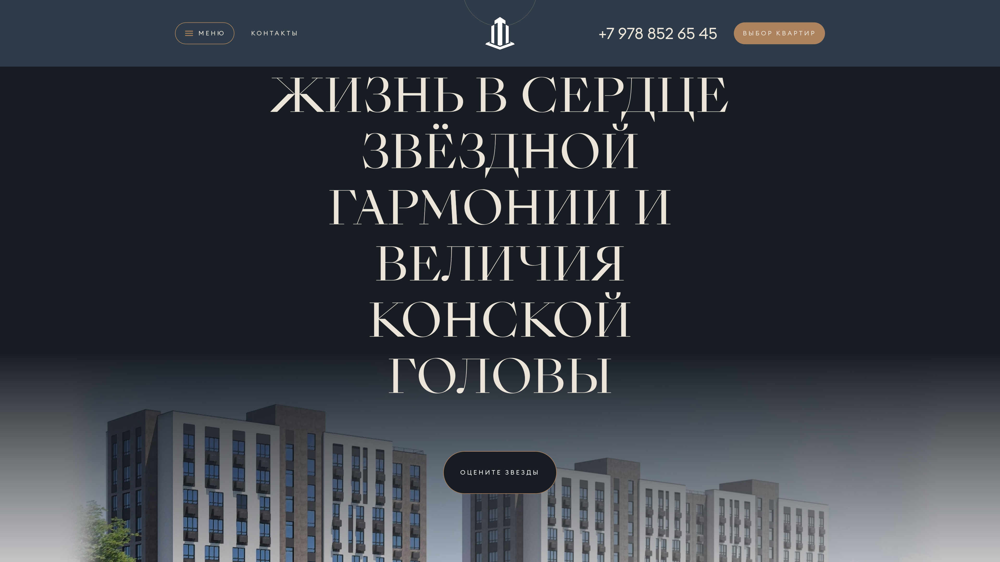
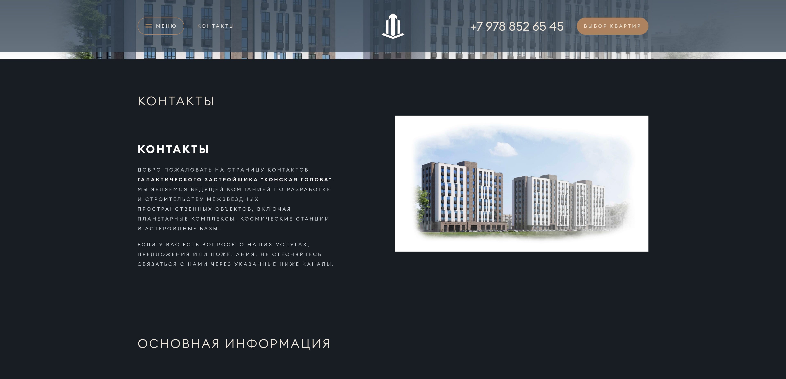

# Документация по блокам

## Верхний баннер с текстовым блоком

---

## Text (Текстовый блок)

Простой текстовый блок используется для вывода информации без дополнительных элементов. Подходит для описаний, статей или инструкций.

---

## Gallery (Галерея)

Блок галереи отображает набор изображений в виде слайдера.

---

## Lead (Лид)

Лидовый блок предназначен для привлечения внимания пользователей. Обычно содержит заголовок, подзаголовок и призыв к действию (например, кнопку).

---

## Feedback (Обратная связь)

Этот блок используется для сбора обратной связи от пользователей. Он включает поля для имени, телефона и сообщения.

---

## Text with Image (Текст с изображением)

Этот блок сочетает текстовое описание с изображением. Изображение может быть расположено справа или слева от текста.
